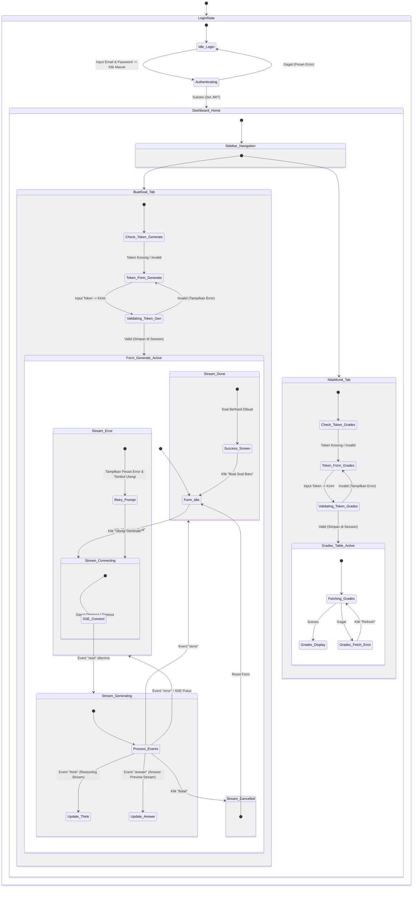

# UI/UX Specification & Interaction Flow: Teacher's Exam Dashboard

Dokumen ini memuat rancangan antarmuka pengguna (UI/UX) dan alur interaksi untuk dashboard guru pada platform SaaS Bank Soal dan Ujian. Sistem ini menggunakan teknologi real-time **Server-Sent Events (SSE)** untuk menayangkan proses berpikir kecerdasan buatan (*reasoning/think stream*) secara live kepada guru.

---

## 🎨 Sistem Desain (Design Tokens)

Sistem ini didesain menggunakan gaya **Sleek Modern SaaS** dengan skema warna yang memberikan kesan premium, cerdas, dan andal.

| Atribut | Keterangan / Token | Contoh Penggunaan |
| :--- | :--- | :--- |
| **Fonts** | Heading: **Outfit** (Variable Font)<br>Body: **Inter**<br>Reasoning/Code: **JetBrains Mono** | Struktur tipografi yang ramah namun presisi untuk dashboard profesional. |
| **Primary Color** | `Violet/Indigo` (`#6366F1` / `#4F46E5`) | Tombol utama, navigasi aktif, aksen branding. |
| **Surface/BG** | Light: `slate-50` (`#F8FAFC`) / Dark: `slate-950` (`#020617`) | Latar belakang dasar workspace. |
| **Card Surface**| Light: `white` (`#FFFFFF`) / Dark: `slate-900` (`#0F172A`) | Panel dashboard, form, area visualisasi. |
| **Success** | `Emerald` (`#10B981` / `#059669`) | Token terverifikasi, status selesai, nilai tuntas. |
| **Warning** | `Amber` (`#F59E0B` / `#D97706`) | Proses sinkronisasi, status koneksi tersendat. |
| **Danger/Error** | `Rose` (`#F43F5E` / `#E11D48`) | Token salah, SSE terputus, pembatalan proses. |

---

## 🗺️ Alur State & Interaksi (State Diagram)

Berikut adalah diagram alur state aplikasi yang mencakup alur login, verifikasi token sekolah, streaming SSE, dan akses tabel nilai.



---

## 🖼️ Wireframe Deskriptif & Tata Letak

### 1. Halaman Login
Halaman dengan tata letak minimalis dan elegan (Split-Screen / Centered Card) untuk memastikan fokus pengguna penuh.

```
+---------------------------------------------------------+
|                                                         |
|                     GuruPintar AI                       |
|          "Asisten Cerdas Pembuat Soal & Ujian"          |
|                                                         |
|                 +---------------------+                 |
|                 |     MASUK AKUN      |                 |
|                 +---------------------+                 |
|                 | Email               |                 |
|                 | [ email@sekolah.sch.id            ]   |
|                 |                                     |
|                 | Kata Sandi                          |
|                 | [ **********                    [o] ] |
|                 |                                     |
|                 | [x] Ingat Saya                      |
|                 |                                     |
|                 |  =================================  |
|                 |  ||         MASUK SEKARANG        ||  |
|                 |  =================================  |
|                 +---------------------+                 |
|                                                         |
+---------------------------------------------------------+
```

---

### 2. Dashboard: Pembuatan Soal (State: Token Belum Terverifikasi)
Sebelum masuk ke form pembuatan soal, guru dihadapkan pada panel verifikasi token sekolah.

```
+----------------------------------------------------------------------------------+
| [G] GuruPintar AI     (o) Pembuatan Soal    ( ) Nilai Murid      [ Keluar ]      |
+----------------------------------------------------------------------------------+
|                                                                                  |
|  Pembuatan Soal Baru                                                             |
|  -----------------------------------------------------------------------------   |
|                                                                                  |
|  +----------------------------------------------------------------------------+  |
|  | 🔒 Verifikasi Akses Sekolah                                                 |  |
|  |                                                                            |  |
|  | Untuk mulai membuat soal menggunakan kecerdasan buatan, silakan masukkan   |  |
|  | Token Sekolah Anda terlebih dahulu.                                        |  |
|  |                                                                            |  |
|  | Token Sekolah                                                              |  |
|  | [ Masukkan 8 karakter token sekolah...                    ] [Verifikasi]   |  |
|  |                                                                            |  |
|  | * Hubungi Operator Sekolah Anda untuk mendapatkan token akses yang sah.   |  |
|  +----------------------------------------------------------------------------+  |
|                                                                                  |
+----------------------------------------------------------------------------------+
```

---

### 3. Dashboard: Pembuatan Soal (State: Form Pengisian & Token Valid)
Setelah token tervalidasi, form konfigurasi soal akan terbuka.

```
+----------------------------------------------------------------------------------+
| [G] GuruPintar AI     (*) Pembuatan Soal    ( ) Nilai Murid      [ Keluar ]      |
+----------------------------------------------------------------------------------+
|                                                                                  |
|  Pembuatan Soal Baru                             [ Token: SMA 1 JKT (✓ Terverifikasi) ] |
|  -----------------------------------------------------------------------------   |
|                                                                                  |
|  +-----------------------------------+  +-------------------------------------+  |
|  | Parameter Pembuatan Soal          |  | Pratinjau Hasil & Analisis AI       |  |
|  |                                   |  |                                     |  |
|  | Mata Pelajaran                    |  | +---------------------------------+ |  |
|  | [ Fisika                        v ]  | | ☕ Siap membuat soal...         | |  |
|  |                                   |  | | Pilih parameter di sebelah kiri | |  |
|  | Jenjang Kelas                     |  | | lalu klik "Mulai Buat Soal".   | |  |
|  | [ Kelas 11 (Fase F)             v ]  | +---------------------------------+ |  |
|  |                                   |  |                                     |  |
|  | Jumlah & Tipe Soal                |  |                                     |  |
|  | [ 5 Soal   v ]   [ Pilihan Ganda v ]  |                                     |  |
|  |                                   |  |                                     |  |
|  | Topik Spesifik                    |  |                                     |  |
|  | [ Termodinamika & Hukum Gas     ] |  |                                     |  |
|  |                                   |  |                                     |  |
|  | Tingkat Kesulitan                 |  |                                     |  |
|  | ( ) Mudah    (*) Sedang    ( ) Sulit |  |                                     |  |
|  |                                   |  |                                     |  |
|  |  ===============================  |  |                                     |  |
|  |  ||       MULAI BUAT SOAL     ||  |  |                                     |  |
|  |  ===============================  |  |                                     |  |
|  +-----------------------------------+  +-------------------------------------+  |
|                                                                                  |
+----------------------------------------------------------------------------------+
```

---

### 4. Dashboard: Pembuatan Soal (State: AI Generating - SSE Stream Live)
Saat proses generate berjalan, layar terbagi secara asimetris untuk menampilkan alur berpikir AI (*think*) dan draft soal (*answer*).

```
+----------------------------------------------------------------------------------+
| [G] GuruPintar AI     (*) Pembuatan Soal    ( ) Nilai Murid      [ Keluar ]      |
+----------------------------------------------------------------------------------+
|                                                                                  |
|  Mengekstrak Soal Termodinamika...               [ Status: Sedang Menulis (60%) ] |
|  -----------------------------------------------------------------------------   |
|                                                                                  |
|  +-----------------------------------+  +-------------------------------------+  |
|  | 🧠 Alur Pikir AI (Live Stream)     |  | 📝 Draft Soal Sementara (Live Stream)|  |
|  |                                   |  |                                     |  |
|  | [10:14:02] Merumuskan konsep      |  |  Soal 1.                            |  |
|  | Hukum I Termodinamika (Q = W + U) |  |  Sebuah gas ideal monoatomik        |  |
|  | > Menentukan suhu awal T1 = 300K  |  |  mengalami proses isobarik pada     |  |
|  | > Menyusun pilihan jawaban peng-  |  |  tekanan 2 x 10^5 Pa...             |  |
|  |   kecoh yang realistis.           |  |                                     |  |
|  |                                   |  |  A. 100 Joule                       |  |
|  | [10:14:08] Menyusun Soal Ke-2     |  |  B. 200 Joule                       |  |
|  | > Fokus pada proses isotermal.    |  |  C. 300 Joule                       |  |
|  | > Menghitung usaha luar (W)       |  |  D. ... (sedang mengetik...)        |  |
|  | > _ (kursor berkedip)             |  |                                     |  |
|  +-----------------------------------+  +-------------------------------------+  |
|  |  ===============================  |  |                                     |  |
|  |  ||         BATALKAN          ||  |  |                                     |  |
|  |  ===============================  |  |                                     |  |
|  +-----------------------------------+  +-------------------------------------+  |
|                                                                                  |
+----------------------------------------------------------------------------------+
```

---

### 5. Dashboard: Nilai Murid (State: Token Valid & Data Tampil)
Tabel nilai murid responsif dengan status penyerahan ujian dan nilai bergradasi warna sesuai ketuntasan minimal.

```
+----------------------------------------------------------------------------------+
| [G] GuruPintar AI     ( ) Pembuatan Soal    (*) Nilai Murid      [ Keluar ]      |
+----------------------------------------------------------------------------------+
|                                                                                  |
|  Tabel Nilai Siswa                               [ Token: SMA 1 JKT (✓ Terverifikasi) ] |
|  -----------------------------------------------------------------------------   |
|                                                                                  |
|  Cari Murid: [ Cari nama siswa...        ]  Pilih Kelas: [ XI-A (Fisika)       v ] |
|                                                                                  |
|  +----------------------------------------------------------------------------+  |
|  | Nama Siswa        | Kelas  | Ujian                | Nilai | Status         |  |
|  |-------------------|--------|----------------------|-------|----------------|  |
|  | Ahmad Rofi'i      | XI-A   | PH 1 Termodinamika   |  85   | [✓ Tuntas]     |  |
|  | Budi Setiawan     | XI-A   | PH 1 Termodinamika   |  92   | [✓ Tuntas]     |  |
|  | Cantika Lestari   | XI-A   | PH 1 Termodinamika   |  58   | [ Remedial ]   |  |
|  | Dian Wijaya       | XI-A   | PH 1 Termodinamika   |  70   | [✓ Tuntas]     |  |
|  | Elga Putra        | XI-A   | PH 1 Termodinamika   |  --   | [ Belum Ikut ] |  |
|  +----------------------------------------------------------------------------+  |
|  Menampilkan 1-5 dari 32 murid                                 [<] Halaman 1 [>]  |
|                                                                                  |
+----------------------------------------------------------------------------------+
```

---

## 🛠️ Rekomendasi Detail Komponen & Desain Interaktif

### A. Panel Validasi Token Sekolah
Untuk menjaga keamanan data sekolah dan penggunaan kuota AI, panel token harus dirancang ramah namun tetap ketat.

*   **Behavior (Perilaku):**
    *   Jika token kosong atau tidak valid di Local / Session Storage, form pembuatan soal dan tabel nilai murid akan di-mount dalam keadaan *locked-state* dengan overlay buram (backdrop blur `backdrop-blur-md` dan background opacity `bg-slate-900/40`).
    *   Sistem melakukan validasi secara otomatis via API call saat tombol "Verifikasi Token" ditekan.
*   **Indikator UX:**
    *   *Idle State:* Tombol verifikasi aktif, input bersih.
    *   *Validating State:* Input dinonaktifkan (`disabled`), tombol berubah menjadi status memuat dengan spinner (`animate-spin`) dan tulisan "Memverifikasi...".
    *   *Success State:* Toast notifikasi hijau meluncur dari pojok kanan atas, panel berkedip hijau lembut (`pulse effect` 300ms), lalu berpindah ke state aktif. Token disimpan di `sessionStorage` agar guru tidak perlu mengetik ulang selama sesi browser berlangsung.
    *   *Error State:* Bingkai input berubah menjadi merah (`ring-rose-500 bg-rose-50`), teks bantuan di bawah input menjelaskan penyebab kegagalan.

### B. Area Streaming Reasoning (🧠 Panel Alur Pikir AI)
Berbeda dengan aplikasi AI umum yang hanya menyajikan jawaban akhir, menampilkan alur berpikir membuat guru merasa lebih memegang kendali dan memahami dasar penyusunan soal.

*   **Desain Visual:**
    *   Wadah panel berlatar belakang gelap (`bg-slate-905` atau `bg-zinc-950`) dengan teks monospaced (`font-mono`) berukuran kecil (`text-xs`) berwarna hijau terminal / emerald redup (`text-emerald-400/80`).
    *   Terdapat ikon otak menyala (`🧠 animate-pulse`) dan teks status "AI sedang menganalisis..." di bagian atas.
*   **Perilaku Autoscroll:**
    *   Setiap potongan teks baru (`think` chunk) yang masuk harus memicu autoscroll ke bawah panel secara otomatis (`element.scrollTop = element.scrollHeight`).
    *   Namun, jika guru secara manual melakukan scroll ke atas untuk membaca langkah sebelumnya, autoscroll akan dijeda (`paused`), dan muncul tombol kecil melayang: "⬇️ Scroll ke bawah".

### C. Area Hasil & Pratinjau Soal (📝 Panel Jawaban/Preview)
Draft soal yang dihasilkan ditampilkan dalam format kartu interaktif yang diperbarui secara langsung.

*   **Format Konten:**
    *   Menggunakan parser markdown (seperti `react-markdown` dengan plugin `remark-gfm` dan `rehype-katex` untuk rumus matematika fisika/kimia) agar soal tercetak rapi dengan superskrip, subskrip, dan simbol sains.
    *   Setiap soal diletakkan dalam kartu (`card border border-slate-100`) lengkap dengan kunci jawaban yang bisa disembunyikan/ditampilkan menggunakan toggle.
*   **Efek Ketik Real-time (Streaming Effect):**
    *   Agar terlihat mulus dan tidak patah-patah, potongan jawaban (`answer` chunk) ditayangkan dengan kursor pengetikan vertikal yang berkedip (`border-r-2 border-indigo-600 animate-blink`) di akhir teks.

### D. Penanganan SSE & Pemulihan Error (Resilience UX)
Koneksi SSE rentan terputus saat berpindah jaringan (misal: Wi-Fi sekolah tidak stabil). UX harus memiliki strategi pemulihan otomatis.

*   **Status Koneksi (Connection Lifecycle State):**
    1.  `CONNECTING`: Mencoba membuka koneksi EventSource. Tombol berubah menjadi "Menghubungkan...".
    2.  `ACTIVE`: Aliran data lancar. Progress bar berjalan secara berkala.
    3.  `DISCONNECTED`: Koneksi putus tak terduga.
*   **Mekanisme Retry Otomatis:**
    *   Jika koneksi terputus tanpa pesan `done`, sistem akan mencoba menghubungkan kembali secara otomatis hingga 3 kali dengan jeda eksponensial (2 detik, 4 detik, lalu 8 detik).
    *   Tampilkan notifikasi toast kuning: *"Koneksi terganggu. Mencoba menghubungkan kembali dalam 2 detik..."*
*   **Tombol Batal & Ulangi:**
    *   Selama proses pembuatan soal berjalan, tombol "Mulai Buat Soal" berubah fungsi menjadi tombol bahaya "Batalkan Proses" (`bg-rose-600 hover:bg-rose-700`). Menekan tombol ini akan memanggil API abort dan menutup koneksi SSE seketika, mengembalikan antarmuka ke state aman.
    *   Jika koneksi gagal total setelah 3 kali percobaan, sajikan tombol "Coba Lagi" berwarna oranye terang, dengan opsi menyimpan konfigurasi parameter agar guru tidak perlu mengisi form dari awal.

---

## ✍️ Copywriting Teks UI Utama

Kumpulan salinan teks (*copy deck*) yang dirancang khusus untuk menciptakan pengalaman pengguna yang intuitif, ramah, dan bebas cemas.

### 🔑 Panel Token Sekolah
*   **Label Input:** `Token Verifikasi Sekolah`
*   **Placeholder Input:** `Contoh: SCH-892A-JKT`
*   **Teks Bantuan (Helper Text):** `Token terdiri dari 8-12 karakter alfanumerik khusus sekolah Anda.`
*   **Pesan Sukses:** `Token berhasil diverifikasi! Selamat datang di Portal Guru SMA Negeri 1 Jakarta.`
*   **Pesan Gagal (Token Invalid):** `Token tidak terdaftar atau telah kedaluwarsa. Silakan periksa kembali atau hubungi Operator Sekolah.`

### ✍️ Form Pembuatan Soal
*   **Tombol Utama (Mulai):** `Mulai Buat Soal ✨`
*   **Tombol Utama (Sedang Berjalan):** `Sedang Menyusun... (65%)`
*   **Tombol Utama (Batal):** `Batalkan Proses 🛑`
*   **Placeholder Topik Soal:** `Contoh: Hukum Newton tentang Gerak atau Efek Dopler Gelombang Bunyi`
*   **Pesan Konfirmasi Pembatalan:** `Apakah Anda yakin ingin membatalkan pembuatan soal? Draf yang sudah dibuat akan terhapus.`

### 📊 Area Streaming & Status
*   **Status Koneksi Terputus:** `Koneksi Terputus! Kami mendeteksi jaringan Anda sedang tidak stabil.`
*   **Tombol Hubungkan Ulang:** `Coba Hubungkan Kembali 🔄`
*   **Teks Menunggu Antrean:** `Menghubungkan ke Server AI... Mohon tunggu sebentar.`

---

## 🏆 Kriteria Sukses UX (UX Acceptance Criteria)

Untuk memastikan kualitas antarmuka aplikasi memenuhi standar industri tertinggi, implementasikan daftar periksa berikut:

*   **[ ] Blokir Akses Tanpa Token:**
    Sistem wajib mengalihkan atau memblokir akses ke halaman pembuatan soal dan nilai jika tidak ada variabel `school_token` yang sah di state global.
*   **[ ] UI Responsif (Mobile-first Layout):**
    *   Pada layar desktop (lebar $\ge 1024\text{px}$), panel alur pikir (reasoning) dan pratinjau draf berdampingan secara horizontal (2 kolom).
    *   Pada layar ponsel (lebar $< 768\text{px}$), layout bertumpuk vertikal dengan tab navigasi di bagian atas untuk beralih antara "🧠 Proses Berpikir" dan "📝 Draf Soal" demi menghemat ruang baca.
*   **[ ] Feedback Haptik & Visual pada Mobile:**
    Tombol utama memberikan efek penekanan mengecil (`scale-95 duration-150`) dan getaran mikro (jika dibuka melalui aplikasi mobile pembungkus/PWA).
*   **[ ] Keandalan Aliran Data (Data Integrity):**
    Jika koneksi putus tengah jalan dan guru menekan tombol "Ulangi", wadah draf harus dibersihkan terlebih dahulu agar draf lama yang tidak lengkap tidak bercampur dengan draf baru.
*   **[ ] Aksesibilitas Kontras & Pembaca Layar (A11y):**
    *   Teks alur pikir AI (reasoning) memiliki rasio kontras minimal 4.5:1 terhadap latar belakang gelap panel.
    *   Area dinamis yang diperbarui secara langsung menggunakan atribut `aria-live="polite"` agar guru tunanetra yang menggunakan pembaca layar dapat mengetahui perkembangan penulisan soal tanpa kehilangan fokus.
